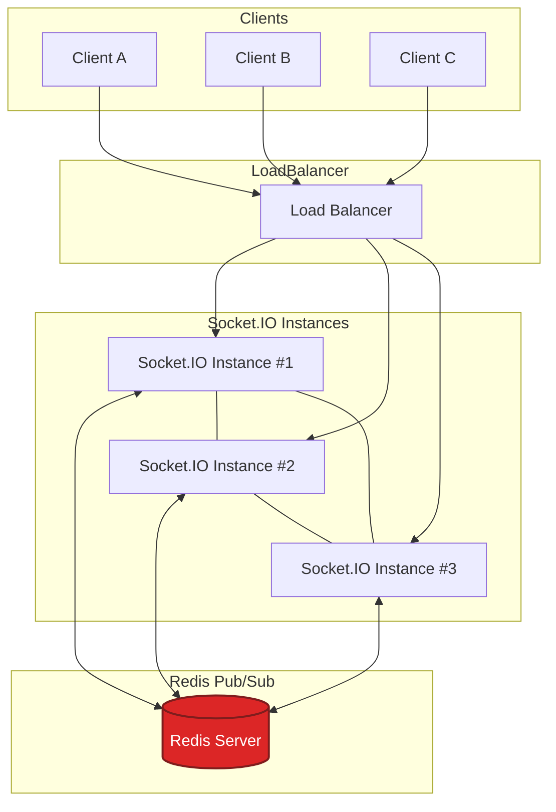

# Partie 1

## Question 1

**Polling long**  
Le client lance une requête HTTP et la garde ouverte jusqu'à ce que le serveur ait quelque chose à envoyer. Dès qu'il y a une nouvelle donnée, le serveur répond et le client relance immédiatement une autre requête. C'est principalement du serveur vers le client, même si c'est le client qui initie.

L'avantage c'est que c'est hyper simple à mettre en place, ça marche partout avec du HTTP classique. Par contre ça génère pas mal de latence et beaucoup de connexions répétées, donc c'est pas terrible à grande échelle. Typiquement ça peut servir pour un chat basique ou des notifications pas trop fréquentes quand t'as pas accès aux WebSockets.

**Server-Sent Events (SSE)**  
Le client ouvre une connexion HTTP persistante et le serveur peut pousser un flux continu d'événements en texte. C'est strictement serveur → client, pas de retour sur le même canal.

Le truc cool c'est que c'est natif dans les navigateurs et plus efficace que le long polling, avec une reconnexion automatique. L'inconvénient c'est que si le client veut parler au serveur, il doit faire des requêtes HTTP séparées. Et ça marche surtout en HTTP/1.x. Parfait pour des flux unidirectionnels : cours de bourse, notifications push, logs en direct.

**WebSockets**  
Après un handshake HTTP initial, la connexion est "upgradée" vers un canal TCP bidirectionnel persistant. Client et serveur peuvent s'échanger des messages dans les deux sens en continu.

C'est la solution la plus performante en termes de latence, avec une communication full-duplex. Idéal pour les applis interactives genre chat évolué, jeux en ligne, dashboards financiers, collaboration temps réel. La contrepartie c'est que c'est plus complexe à implémenter et sécuriser, et certains proxies ou architectures HTTP strictes peuvent poser problème.

## Question 2

**Namespaces**  
Ça permet de segmenter les communications sur un même serveur WebSocket. Chaque namespace (`/chat`, `/admin`...) fonctionne comme un canal logique avec ses propres événements et sa propre logique. L'intérêt c'est d'isoler les flux et éviter que tous les clients écoutent tous les événements.

Exemple : un namespace `/admin` pour les messages système réservés aux modérateurs, complètement séparé du namespace `/public` pour les utilisateurs classiques.

**Rooms**  
C'est des sous-groupes à l'intérieur d'un namespace. Un client peut rejoindre plusieurs rooms et le serveur peut cibler un message vers tous les membres d'une room spécifique sans dupliquer les connexions.

Exemple : dans un namespace `/chat`, chaque salon de discussion est une room - `room("paris")`, `room("lyon")`. Les messages envoyés à `room("paris")` ne sont reçus que par ceux qui sont dedans.

**Broadcast**  
C'est l'envoi d'un message à tous les clients connectés sauf celui qui l'a émis, dans un namespace ou une room donnée.

L'intérêt c'est d'informer les autres sans renvoyer bêtement le message à sa source. Exemple classique : quand un utilisateur poste un message dans un salon, le serveur fait `socket.broadcast.to("paris").emit("message", msg)` pour notifier tous les autres membres sans réémettre au gars qui vient d'écrire.

## Question 3

**Le problème**  
Socket.IO stocke les connexions en mémoire sur chaque instance. Si le client A est connecté sur l'instance 1 et le client B sur l'instance 2, quand A envoie un message avec `socket.broadcast.emit()`, seuls les clients de l'instance 1 le reçoivent. L'instance 2 n'est pas au courant. Résultat : diffusion partielle, certains clients ne reçoivent rien.

**La solution Redis Pub/Sub**  
Le Redis Adapter connecte toutes les instances Socket.IO à un système de publication/souscription Redis. Quand une instance émet un message, elle le publie dans Redis qui le propage à toutes les autres instances via ses canaux Pub/Sub. Chaque instance relaye ensuite le message aux sockets locales concernées. Du coup tous les clients reçoivent le même message, peu importe sur quel serveur ils sont connectés.

Chaque serveur Node communique avec Redis pour propager les événements Socket.IO entre instances. Ça permet une scalabilité horizontale et une synchronisation temps réel globale.

## Question 4

**3 risques de sécurité**

Injection de messages : un client malveillant peut émettre des événements falsifiés genre `emit("admin:deleteUser")` s'il n'y a pas de vérification d'autorisation côté serveur.

Vol de session ou token : si un JWT ou une session Socket.IO est interceptée, l'attaquant peut usurper une connexion active.

DDoS par spamming d'événements : envoi massif de messages pour saturer le serveur ou le réseau.

**3 bonnes pratiques**

Authentification et autorisation sur chaque connexion - vérifier le JWT dans `io.use()` avant la `connection`.

Validation stricte des messages côté serveur avec des schémas JSON, des limites de taille et du filtrage sur les commandes interdites.

Rate limiting et quotas par socket ou par IP pour éviter les floods et les abus.

**3 métriques à surveiller**

Nombre de connexions actives pour suivre les pics et détecter les fuites de sockets.

Latence moyenne des messages, du moment où ils sont émis jusqu'à leur réception.

Taux d'erreur ou de reconnexions qui indique des problèmes d'instabilité réseau, des crashs ou des timeouts.

**Outil de monitoring**

Prometheus + Grafana pour la collecte et la visualisation des métriques Socket.IO. Ou plus simple : des logs applicatifs (console.log, Winston, Pino) exportés vers Elastic/Kibana pour la supervision temps réel.

## Question 5

Déployer une architecture scalable horizontalement avec plusieurs instances Socket.IO/WebSocket derrière un load balancer, synchronisées via Redis Pub/Sub ou un message broker. Ça évite les pertes de messages et supporte la montée en charge.

Appliquer un rate limit par client (nombre d'événements émis par seconde) et filtrer les messages non essentiels pour prévenir les abus et les ralentissements serveur.

Optimiser la sérialisation et la taille des messages en utilisant du JSON compact ou un format binaire type MessagePack ou Protobuf pour réduire la latence et la bande passante.

Gérer proprement les déconnexions et reconnexions avec un mécanisme de reconnexion automatique côté client (`reconnection`, `reconnectionAttempts`) et conserver l'état utilisateur (session, room) même au redémarrage du serveur.

Mettre en place une surveillance continue en suivant les métriques critiques - latence, mémoire, CPU, connexions actives - et journaliser les erreurs avec un système centralisé type Prometheus, Grafana ou des logs structurés.
