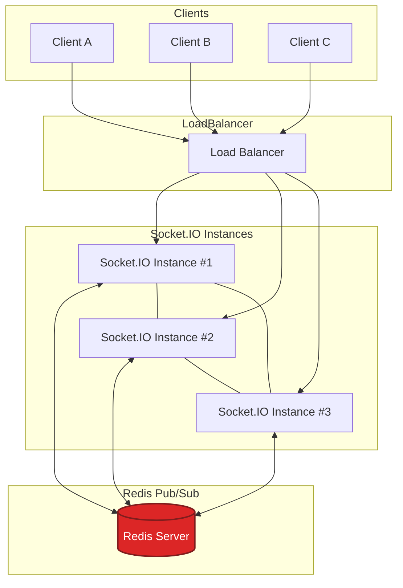

# Partie 1 

## Question 1 

**Polling long**
Principe : le client envoie une requête HTTP au serveur et garde la connexion ouverte tant qu’aucun nouvel événement n’est disponible. Le serveur répond dès qu’il a une donnée, puis le client rouvre immédiatement une nouvelle requête.
Sens : principalement **serveur → client**, mais initié **par le client**.
Avantages : simple à implémenter (HTTP standard, compatible partout).
Limites : latence plus élevée, overhead réseau (nombreuses connexions), peu efficace à grande échelle.
Cas d’usage : notifications ou mises à jour peu fréquentes dans des environnements sans support WebSocket (ex. chat basique, monitoring simple).

**Server-Sent Events (SSE)**
Principe : le client ouvre une connexion HTTP persistante et le serveur envoie un flux continu d’événements encodés en texte.
Sens : **serveur → client** unidirectionnel.
Avantages : natif dans les navigateurs, plus efficace que le long polling, conserve l’état de la connexion automatiquement.
Limites : pas de communication client → serveur sur le même canal (il faut des requêtes HTTP séparées), support limité à HTTP/1.x.
Cas d’usage : flux temps réel à sens unique (ex. données boursières, notifications, logs temps réel).

**WebSockets**
Principe : une fois la connexion initiale HTTP établie, elle est “upgradée” vers un canal TCP persistant bidirectionnel. Client et serveur peuvent s’envoyer des messages en continu.
Sens : **bidirectionnel**.
Avantages : très faible latence, communication full-duplex, excellente scalabilité pour les interactions dynamiques.
Limites : plus complexe à mettre en œuvre et à sécuriser, non compatible avec certains proxy ou architectures strictement HTTP.
Cas d’usage : applications interactives temps réel (chat évolué, jeux en ligne, collaboration simultanée, dashboards financiers).

## Question 2 

**Namespaces**
Ils permettent de segmenter la communication au sein d’un même serveur WebSocket. Chaque namespace agit comme un canal logique (ex. `/chat`, `/admin`) avec sa propre logique et ses propres événements.
Intérêt : isoler les flux et réduire la complexité (moins d’écouteurs inutiles).
Exemple : un serveur Socket.IO avec un namespace `/admin` pour les messages système réservés aux modérateurs, distinct du namespace `/public` pour les utilisateurs.

**Rooms**
Les rooms sont des sous-groupes au sein d’un namespace. Un client peut rejoindre plusieurs rooms, et le serveur peut envoyer un message à tous les clients d’une room donnée.
Intérêt : cibler une audience spécifique sans dupliquer de connexions.
Exemple : dans un namespace `/chat`, chaque salon (“room”) correspond à un canal de discussion : `room("paris")`, `room("lyon")`, etc. Les messages envoyés à `room("paris")` ne sont reçus que par ses membres.

**Broadcast**
C’est l’envoi d’un message à **tous les clients connectés sauf l’émetteur**, dans un namespace ou une room donnée.
Intérêt : informer les autres utilisateurs sans renvoyer inutilement le message à la source.
Exemple : quand un utilisateur envoie un message, le serveur fait `socket.broadcast.to("paris").emit("message", msg)` pour notifier tous les autres membres du salon, mais pas celui qui vient d’écrire.

## Question 3 

**Problème :**
Socket.IO stocke les connexions en mémoire sur chaque instance du serveur. Si un client A est connecté sur l’instance 1 et qu’un autre client B est sur l’instance 2, un message émis par A (ex. `socket.broadcast.emit()`) n’est visible que sur l’instance 1. Les autres serveurs ne connaissent pas les sockets connectées ailleurs. Résultat : la diffusion échoue partiellement — certains clients ne reçoivent rien.

**Solution via Redis Pub/Sub :**
Le **Redis Adapter** connecte toutes les instances Socket.IO à un **canal de publication/souscription** Redis.

* Quand une instance émet un message (`emit`, `broadcast`, etc.), elle le **publie** dans Redis.
* Redis le **propage** à toutes les autres instances via ses canaux “Pub/Sub”.
* Chaque instance **relaye** ensuite le message aux sockets locales concernées.
  Ainsi, tous les clients — peu importe le serveur sur lequel ils sont connectés — reçoivent le même message.

Chaque serveur Node communique avec Redis pour propager les événements Socket.IO entre instances, assurant une **scalabilité horizontale** et une **synchronisation temps réel** globale.

